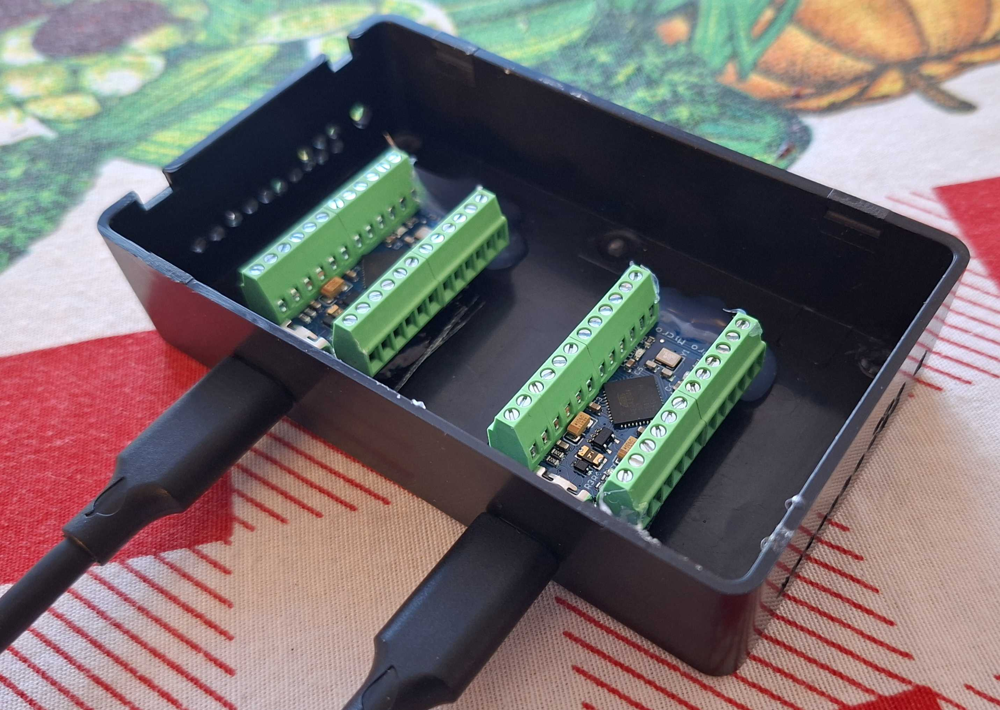
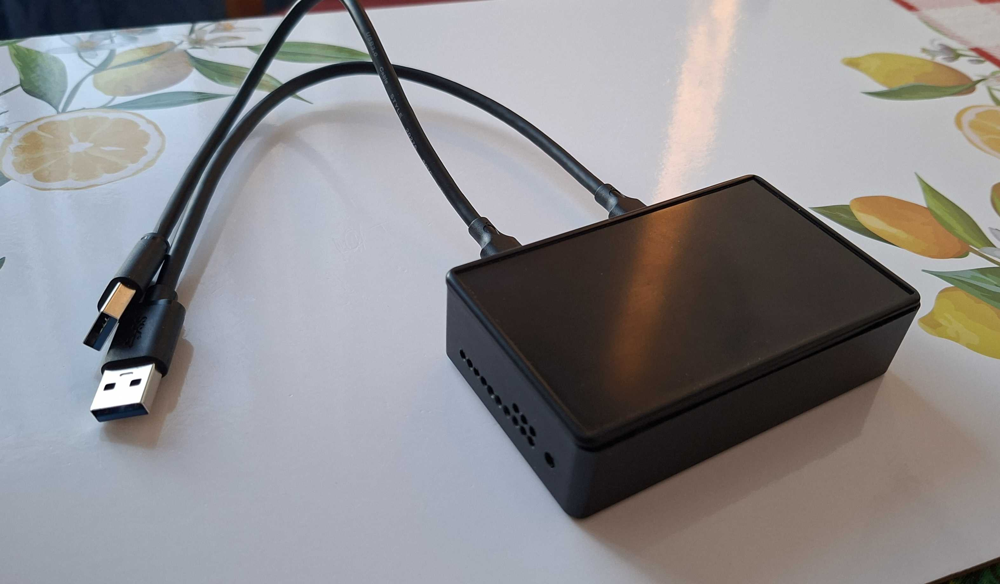
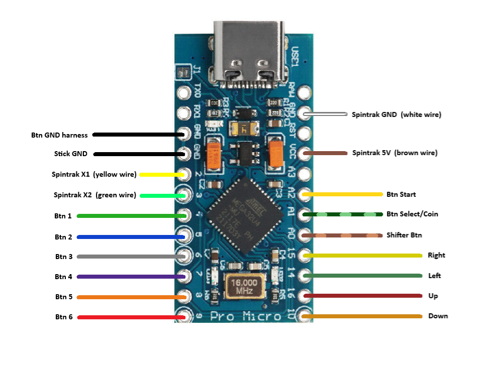
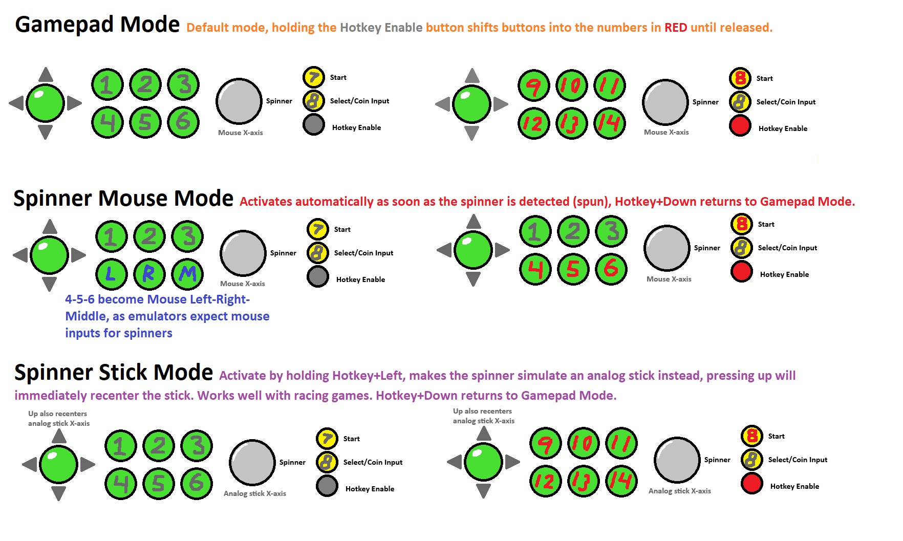

# Spintrak-and-buttons-Arduino-encoder
Turns the ultimarc spintrak spinners into either USB mouse x-axis mode or left-stick-x-axis mode, using an Arduino Pro Micro. 
The arduino also works as an arcade button+stick encoder as well. Giving you stick+spinner+8buttons+hotkey functionality.

>The spintrak is tuned to have the same sensitivity as the original included ultimarc encoder.
>If you want to tune the sensitivity to your own liking, edit the values in these lines:

>```accumulator -= (delta * 6) / 5;```
>For example: accumulator -= (delta * 3) / 5; would be half as sensitive

>Stick mode sensitivity:
>```int32_t temp = (int32_t)stickX + ((int32_t)move * 80);```
>(80 is default, higher = more sensitive)

>The hotkey shifts buttons into a higher button number.

* **Gamepad Mode: Default mode:** Holding the **Hotkey Enable** button shifts buttons into the button numbers in RED, until released.
* **Mouse Click Mode:** Toggles on/off by pressing **Hotkey+Down**, turns button 4-5-6 (bottom row in a six button layout) into Mouse Left-Right-Middle clicks. Used with emulators that require mouse clicks as spinner input.
* **Spinner Stick Mode:** Toggles on/off by pressing **Hotkey+Left**, makes the spinner simulate an analog stick instead, while in this mode, pressing **Up** recenteres the simulated analog stick. Works well with racing games.

Pinout for the build are shown in the image below. Pay attention to the wire colors of the Spintrak.

Remember to copy over the Library dependencies into your Documents/Arduino/Libraries folder before flashing the .ino to the Arduino Pro Micro.

In my build I used a generic plastic enclosure, screw terminals, and 2x Arduino Pro Micro (USB-C). 
The Spintrak hooks up with 4pin dupont connectors.

---

    

---
